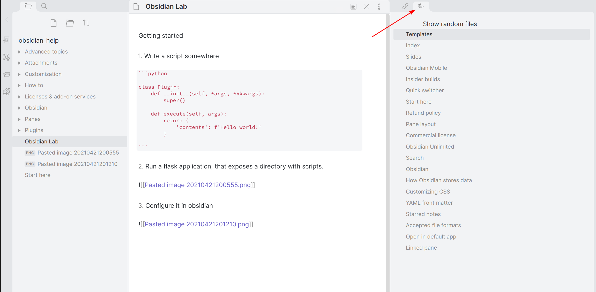
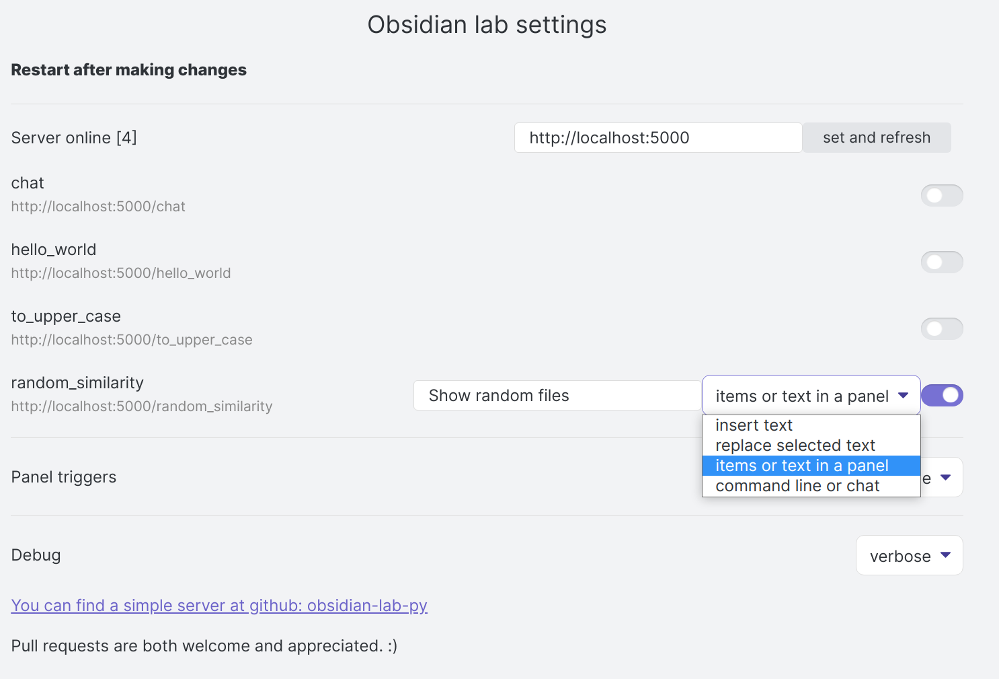

# Obsidian Python lab plugin

Say you have a terrific script to:

-   Find similar notes to the current one.
-   Translate a text.
-   Write the summary of a note.
-   ....

And you want to quickly see if it's helpful in Obsidian, just using some python.

That is the purpose of this plugin!. 

## Why this plugin? Why not program all in Javascript?

Sometimes is quicker to experiment in Python and later, if you want, make it work in Javascript. This is especially true when using Natural Language Processing libraries.

## How it works?

The plugin is just a GUI to make calls to a server of your choice. Currently, the plugin has implemented the following
 operations:

1.  Insert new text.
2.  Replace the current text.
3.  Show elements in a panel.
4.  Have a chat conversation



## Plugin-Server interaction

1. When the user runs one of the plugin's commands, for example, 'replacing fancy text,' the plugin makes a POST call to your server with some context data, such as the current note, what was selected, etc. 

Say your terrific script returns a list of random notes of your vault. Then the plugin does:

> POST: <http://127.0.0.1:5000/scripts/some_list>

With some context data

```json
{
  "vaultPath": "/home/cvasquez/obsidian/development",
  "notePath": "snippets-plugin/Test1.md"
}
```

It then returns a JSON response, which the plugin uses to show something in a Widget

> Response

```json
{
  "contents": [
    {
      "info": { "score": "0.9820077811564822" },
      "path": { "path": "/path/to/the/note 1.md" }
    },
    {
      "info": { "score": "0.9365154046414078" },
      "path": { "path": "/path/to/the/note 2.md" }
    }
  ]
}
```

## Quickstart

1.  Install the plugin. (Maybe you already did)

2.  Write a script somewhere

```python
def hello():
    return {
        'contents': f'Hello world!'
    }
```

3.  Run the application to expose the script. 


4.  The script should be now be detected by the plugin. Then the operation needs to be configured to specify how it interacts with the user. Any change in the options will persist in the plugin configuration. 



5.  Use it!


## Example python server

I wrote a minimal server,  [obsidian-lab-py](https://github.com/cristianvasquez/obsidian-lab-py), that exposes some scripts. It might be useful to look at. I use something different each time, like this [example](https://gist.github.com/cristianvasquez/6b8a13d6452b7600a64b4e554939e052).

## Build the plugin

This is not necessary if the plugin is installed from the store. However, it is built like all the other plugins,

1.  Clone this repo into

/{vault}/.obsidian/plugins

2.  Install the dependencies

    yarn install

3.  build the app

    yarn build

This will build the main file; that Obsidian should detect. Activate the plugin from inside Obsidian, in community plugins

## Forum

This repo has github [discussions](https://github.com/cristianvasquez/obsidian-lab/discussions) enabled.

## Status

This is still a proof of concept; please send any feedback :)

# Contributing

Pull requests are both welcome and appreciated.
