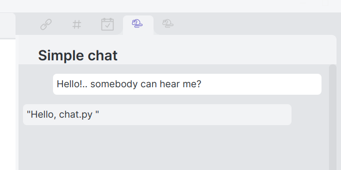

# Obsidian lab plugin

Say you have a terrific script to:

-   Find similar notes to the current one.
-   Translate a text.
-   Write the summary of a note.
-   ....

And you want to quicky see if it's helpful in Obsidian, just using some python.

That is the purpose of this plugin!. 

This plugin uses a [obsidian-lab-py](https://github.com/cristianvasquez/obsidian-lab-py) that executes scripts. This 
plugin is the part that shows results in obsidian. 

## Why this plugin? Why not program all in Javascript?

Sometimes is quicker to experiment in Python and later, if you want, make it work in Javascript. This is especially true when using Natural Language Processing libraries

## Status

This is still a proof of concept, expect bugs

## Requirement

Install and run a web server, such as [obsidian-lab-py](https://github.com/cristianvasquez/obsidian-lab-py), that 
exposes python [scripts](https://github.com/cristianvasquez/obsidian-lab-py/tree/main/examples)

Perhaps someone else wants to do write a similar one using javascript, rust, or other language? :D

## How it works?

1.  The plugin makes a call using POST.

> POST: <http://127.0.0.1:5000/scripts/some_list>

```json
{
  "vaultPath": "/home/cvasquez/obsidian/development",
  "notePath": "snippets-plugin/Test1.md"
}
```

And gets a JSON response

> Response

```json
{
  "contents": [
    {
      "info": { "score": "0.9820077811564822" },
      "path": { "path": "/path/to/the/note 1.md" }
    },
    {
      "info": { "score": "0.9365154046414078" },
      "path": { "path": "/path/to/the/note 2.md" }
    }
  ]
}
```

2.  An obsidian widget is populated with the JSON response.


## Interaction

Currently there are four ways of interaction implemented:

1. Insert text.
2. Replace text.
3. Show elements in a panel.
4. A chat or command line.



## Config

Configuring the plugin currently is done via the settings, where you specify what is triggered, how is it shown, 
etc...


TODO: Give an example.

## Build

is built like all the other plugins,

1.  Clone this repo into

/{vault}/.obsidian/plugins

2.  Install the dependencies


    yarn install

3.  build the app


    yarn build

This will build the main file; that Obsidian should detect. Activate the plugin from inside Obsidian, in community plugins

# Developer log

## Mar 28: POC, Get similar notes to the current one.

-   [x] Proof of concept
-   [x] Run commands directly
-   [x] Python example.
-   [x] Javascript example.

## Apr 1: Multiple experiments

-   [x] Multiple experiments
-   [x] Text panel
-   [x] Result list panel
-   [x] Experiment commands

## Apr 5: HTTP Calls

-   [x] HTTP calls
-   [x] Python plugin system
-   [x] Add text handler
-   [x] Readme

## Apr 6: Command line

-   [x] Parametrized python server

## Apr 7: Split in two

-   [x] Splitted into plugin and [server](https://github.com/cristianvasquez/obsidian-lab-py) repos

## Apr 8: Settings

-   [x] Add settings

## Apr 9: Application state

-   [x] Refactor

## Apr 12: Review

-   [x] Refactor

## Apr 21: Add new view

-   [x] Add chat and command view.

## TODO

-   [ ] Choose an different icon for the services.
